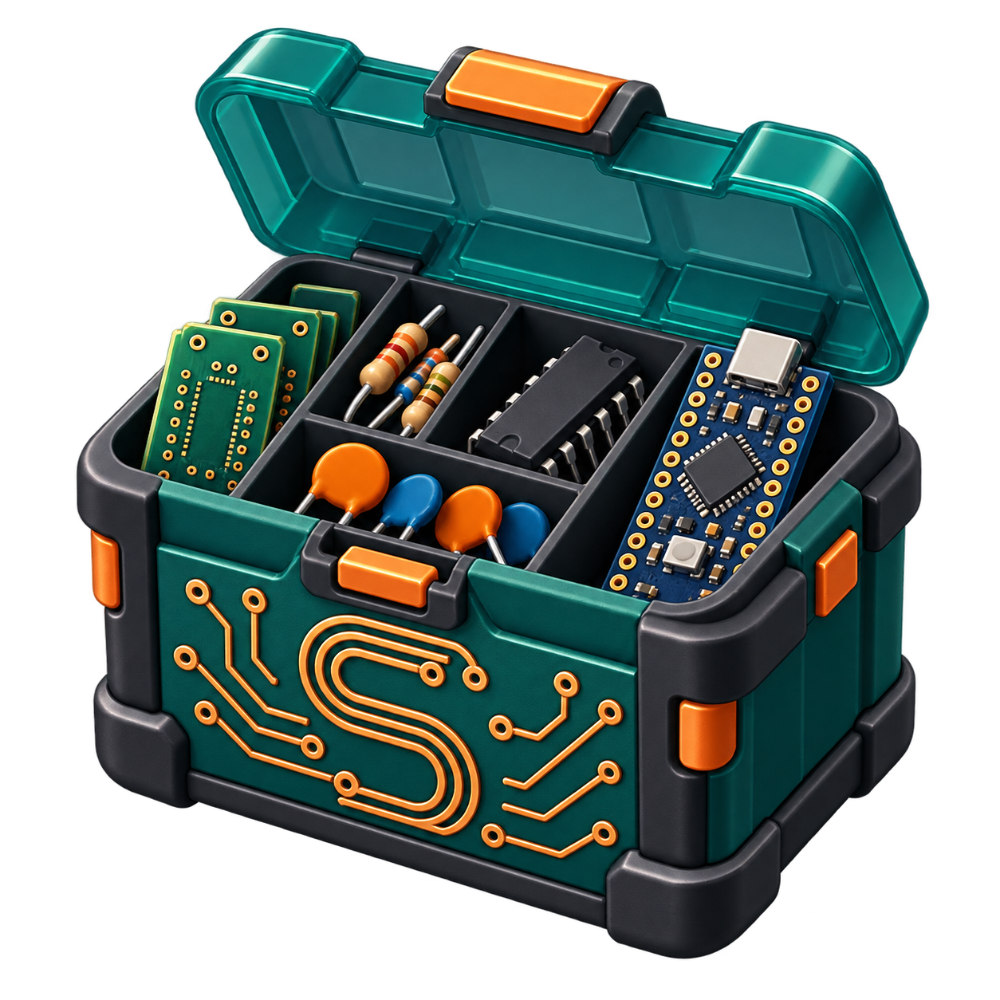

<div align="center">
  

  # Simone's LibrePCB Component Box

  A carefully crafted collection of reusable components for LibrePCB.
</div>

## About

This library contains symbols, components, packages, devices, and selected 3D
models created for personal electronics projects and shared with the LibrePCB
community.

The current release was created and tested with **LibrePCB 2.1.1**.

## Included parts

- Daisy Seed3, including a custom 40-pin THT package and detailed STEP model
- 6N138 optocoupler
- 74HC14 hex Schmitt-trigger inverter
- CD4051 analog multiplexer/demultiplexer
- MCP6022 dual operational amplifier
- MCP23017 I/O-expander module
- I2C LCD display module
- KY-040 rotary encoder module
- Female 5-pin DIN MIDI connector
- TS jack
- External switch

## Installation

Close LibrePCB, then clone the repository into the `data/libraries/local`
directory of your LibrePCB workspace:

```bash
git clone https://github.com/SimoneDeAngelis95/Simones-LibrePCB-Component-Box.git \
  Simones-LibrePCB-Component-Box.lplib
```

Alternatively, download the repository as a ZIP archive, extract it into the
same directory, and ensure that the extracted folder ends with `.lplib`.

Restart LibrePCB and wait for the library scan to complete.

## Library structure

- `sym/` - schematic symbols
- `cmp/` - logical components and signals
- `pkg/` - PCB packages and STEP models
- `dev/` - mappings between components and packages

## Contributing

Bug reports, dimensional corrections, and new part suggestions are welcome
through GitHub Issues. Please include the manufacturer's datasheet whenever a
change concerns mechanical dimensions or pin assignments.

## License

A license has not been selected yet. Until one is added, normal copyright rules
apply.
